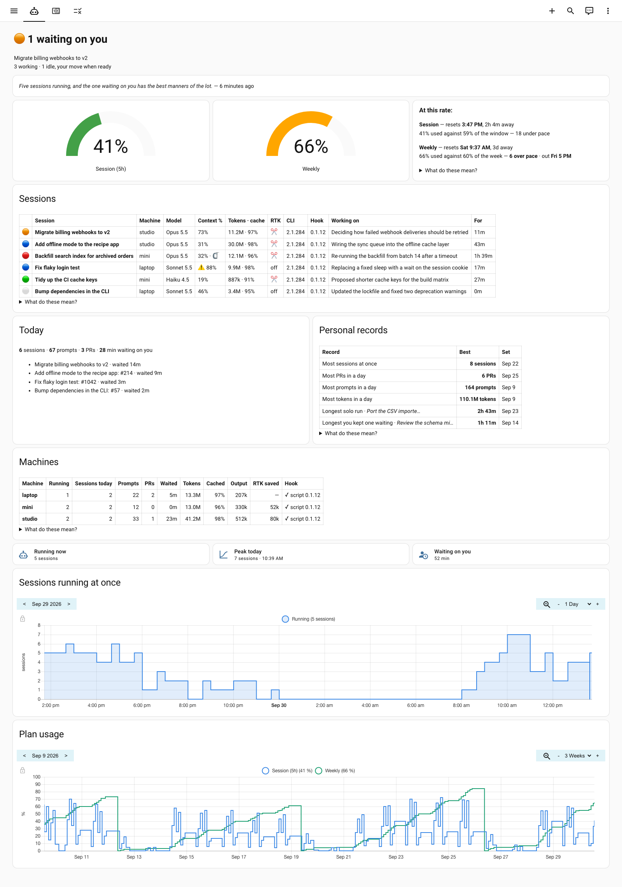
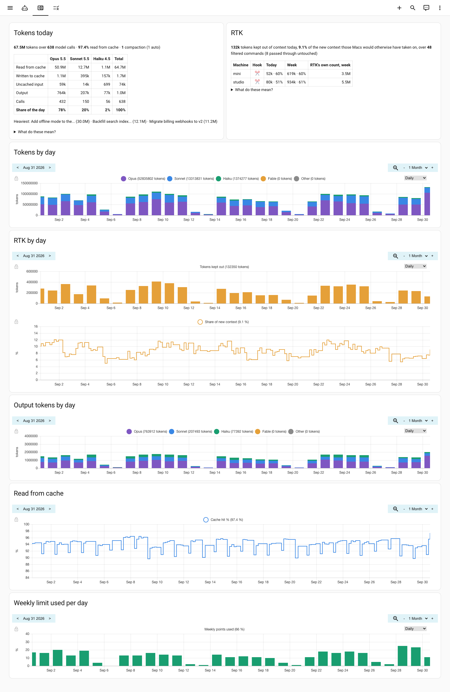
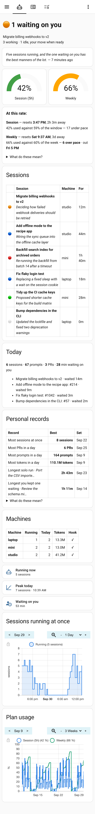
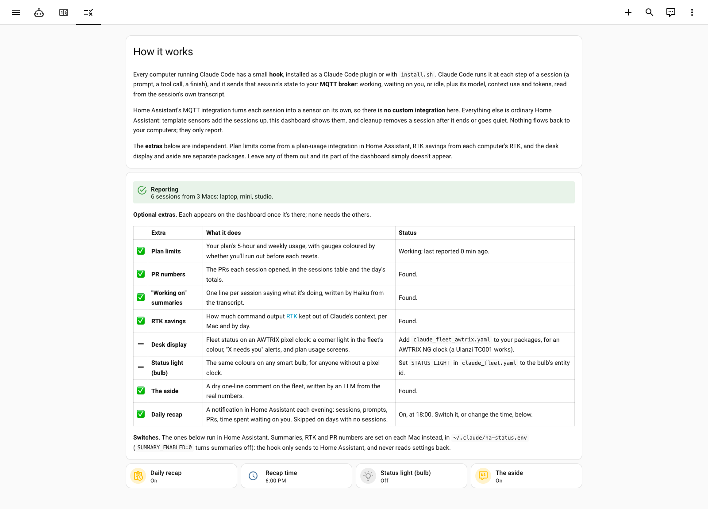

# Home Assistant Claude Fleet

*An independent project, not made by or affiliated with Anthropic.*

Keep track of many concurrent Claude Code sessions across several computers. Each session
reports its state to Home Assistant over MQTT, and HA turns that into a wall dashboard, a
status light and a daily recap.

**Tested on macOS, and on Linux by the automated tests.** On Windows, use WSL.



<sub>All names and numbers in these screenshots are invented, from the demo in `tests/e2e/demo/`.</sub>

What you get:

- **Sessions tab:** every session live (working, waiting on you, idle, stale), its model,
  context use and tokens today; what it is working on; the day so far; personal records;
  one row per computer; how many sessions ran at once; your Claude plan limits and whether
  you are on course to hit them.
- **Tokens tab:** today's tokens by model and by kind, cache hit rate and compactions, and
  the same by day over any range you pick. Plus what [RTK](https://github.com/rtk-ai/rtk)
  saved, if you use it.
- **Setup tab:** a checklist of what is working and what you could add next, and the
  switches.
- **Optional:** phone alerts when a session is waiting on you or a plan limit is running
  hot (two blueprints, a couple of clicks each), a status light (an AWTRIX pixel clock, or
  any smart bulb) and a dry one-line aside written by an LLM from the real numbers.

<details>
<summary>The Tokens tab, and the Sessions tab on a phone</summary>





</details>

Home Assistant needs no custom integration: the computers push over MQTT, and everything else
is template sensors and YAML. [How it works](docs/HOW-IT-WORKS.md) has the details.

## Requirements

**Required**

- Home Assistant with the **MQTT** integration and a broker it uses (the Mosquitto add-on is
  the usual one).
- **A broker login for the computers.** With the Mosquitto add-on, any Home Assistant user can
  log in to the broker, so create one for this: Settings → People → Users → Add user (turn on
  Advanced mode in your profile if you don't see Users), named `claude-mqtt`, say. With another
  broker, create a login the way it does.
- **[History explorer card](https://github.com/alexarch21/history-explorer-card)**, from
  HACS. Every chart on the dashboard is one.
- On each computer: Claude Code, `jq`, and the Mosquitto clients (`brew install mosquitto jq`
  on a Mac, `sudo apt-get install mosquitto-clients jq` on Debian/Ubuntu). Only the clients:
  the broker runs in Home Assistant.

**Optional**, each shown on the dashboard once it is there ([details](docs/EXTRAS.md)):
`gh` for PR numbers; a Home Assistant integration that reports your Claude **plan limits**,
such as [Clawdmeter](https://github.com/corgan2222/ha-clawdmeter) or
[Claude Usage](https://github.com/trickv/hass-claude-usage); [RTK](https://github.com/rtk-ai/rtk);
an **AWTRIX NG** pixel clock or any smart bulb; a conversation agent or HA's AI Task, for the
aside.

**Platforms.** Built and used daily on macOS. On Linux, the automated tests install the hook
with `install.sh` and drive real sessions through it on every change (Ubuntu, via apt), but
nobody uses it there day to day yet. Windows: run Claude Code under WSL, which is the Linux
case. The Home Assistant side doesn't care what the computers run.

## What leaves your computer

Worth knowing before you install, because it's easy not to think about:

- **Every session's last prompt** (the first 200 characters, pasted blocks redacted) is
  published to MQTT. It lands in Home Assistant's recorder database, and on any screen
  showing the dashboard.
- **The "working on" summary** sends the tail of each session's transcript to an LLM (a
  `claude -p` call on Haiku, from your own Claude Code login) every ten minutes or so while
  the session is active, and publishes the one-line result. `SUMMARY_ENABLED=0` in
  `ha-status.env`, or the plugin's summaries option, turns it off.
- **Also published:** repo and branch names, PR numbers, session titles, token counts, and the
  computer's name. All of it stays on your network unless your broker or Home Assistant is
  exposed.
- **Only when you run `scripts/diagnose.sh`:** its report (file paths, which tools it found,
  and your settings except the password) is published, retained, to
  `claude/<machine>/diag/report`, so it can be read from the Home Assistant end.

- **Only if you turn on the update check:** Home Assistant asks GitHub's public API once a
  day for this project's newest release. Nothing about you or your setup is sent.

Nothing is sent anywhere else. The hook talks only to your MQTT broker (and to `gh` and
`claude`, if you have them). The MQTT password never appears on a command line, where other
users of the computer could see it.

## Install

Home Assistant first, since that's where the broker login comes from; then each computer.

### 1. In Home Assistant

Get the files onto Home Assistant however you normally do (the Samba share, SSH or File editor
add-ons, or the config folder of a container). Create `/config/packages/` and
`/config/dashboards/` if they don't exist: startup validation fails on a missing one.

Add these keys to `configuration.yaml`. If it already has a `homeassistant:` or `lovelace:`
section, merge them into it rather than adding a second one:

```yaml
homeassistant:
  packages: !include_dir_named packages
lovelace:
  dashboards:
    claude-fleet:
      mode: yaml
      title: Claude Fleet
      icon: mdi:robot-outline
      show_in_sidebar: true
      filename: dashboards/claude_fleet.yaml
```

Both files are called `claude_fleet.yaml`, so mind which is which:

- `homeassistant/packages/claude_fleet.yaml` goes in `/config/packages/`.
- `homeassistant/dashboards/claude_fleet.yaml` goes in `/config/dashboards/`.

Install **History explorer card** via HACS first, or every chart renders as an error. Then
**restart**: a new package and a new dashboard both need one.

### 2. On each computer

**On a Mac, allow your terminal under Local Network first.** macOS blocks programs that
aren't signed by Apple, such as Homebrew's `mosquitto_pub`, from reaching your local network
until you allow the app that runs them. In System Settings → Privacy & Security → **Local
Network**, turn on the terminal app you start Claude Code from, then **fully quit it (⌘Q) and
reopen it**; a new tab or window is not enough. Without this, every publish fails with `Bad
file descriptor` (Homebrew's Python gets `Errno 65 No route to host`), while `curl` and `nc`
to the same host work fine, which makes it look like anything but a permission. iTerm also
runs shells under `iTermServer`, which the app's permission may not cover: turning off its
job-server setting (Settings → Advanced) makes shells direct children of iTerm.app.

Then install the hook, either way (not both):

**As a Claude Code plugin (recommended).** Inside Claude Code:

```
/plugin marketplace add leftover-salmon/home-assistant-claude-fleet
/plugin install claude-fleet@claude-fleet
```

It asks for your broker, MQTT login, this computer's name on the dashboard (**different on
each computer**), the stale limit (20 on an always-on machine, 0 on a laptop) and whether to
write summaries. The settings screen is a plain list: highlight a row with the arrow keys and
press Enter to edit it. To change anything later: `/plugin` → **Installed** → claude-fleet →
**Configure options**.

**With the script,** if you'd rather not use plugins:

```bash
cd ~
git clone https://github.com/leftover-salmon/home-assistant-claude-fleet.git
cd home-assistant-claude-fleet && ./install.sh
```

Keep the clone: it is where updates come from. `install.sh` installs the hook, adds it to
`~/.claude/settings.json` (with a backup) and creates `~/.claude/ha-status.env`, readable only
by you. It never asks for the MQTT password, and is safe to re-run. Edit `ha-status.env`:

- `MQTT_HOST`: your broker. The default, `homeassistant.local`, is right for the Mosquitto
  add-on on a standard Home Assistant.
- `MQTT_USER` and `MQTT_PASS`: the broker login from Requirements. The template assumes a user
  called `claude-mqtt`.
- `CLAUDE_HA_MACHINE`: **unique per computer**; it is the dashboard's Machine column.
- `CLAUDE_HA_STALE_MINUTES`: 20 on an always-on machine, 0 on a laptop.

<details>
<summary>Without the script or the plugin, by hand</summary>

1. `brew install mosquitto jq gh` (do **not** `brew services start mosquitto`: the broker runs
   in Home Assistant). `gh` is optional; it only supplies PR numbers.
2. Allow Local Network, as above.
3. `cp hooks/claude-ha-status.sh ~/.claude/hooks/ && chmod +x ~/.claude/hooks/claude-ha-status.sh`
4. `cp ha-status.env.example ~/.claude/ha-status.env && chmod 600 ~/.claude/ha-status.env`,
   then set the four settings listed above.
5. Merge the hook into `~/.claude/settings.json` for `SessionStart`, `UserPromptSubmit`,
   `PreToolUse`, `PostToolUse`, `Notification`, `Stop`, `SessionEnd`. **Append, never
   replace**, and keep any existing hooks. The merge below is idempotent:

```bash
cp ~/.claude/settings.json ~/.claude/settings.json.bak-$(date +%Y%m%d-%H%M%S)
H='{"matcher":"*","hooks":[{"type":"command","command":"$HOME/.claude/hooks/claude-ha-status.sh","timeout":5}]}'
jq --argjson h "$H" '
  .hooks = (.hooks // {}) |
  reduce ("SessionStart","UserPromptSubmit","PreToolUse","PostToolUse","Notification","Stop","SessionEnd") as $e (.;
    if ((.hooks[$e] // []) | tostring | test("claude-ha-status")) then .
    else .hooks[$e] = ((.hooks[$e] // []) + [$h]) end)
' ~/.claude/settings.json > /tmp/settings.new && jq empty /tmp/settings.new && mv /tmp/settings.new ~/.claude/settings.json
```

</details>

Only sessions started after installing report.

### 3. Check it

- **On the computer:** `./scripts/diagnose.sh` from the clone makes a test publish and says
  what is missing.
- **In Home Assistant:** open **Claude Fleet** in the sidebar and go to the **Setup** tab. It
  shows which computers are reporting and which extras are working.

  <details><summary>What the Setup tab looks like</summary>

  

  </details>
- **The charts start empty.** They fill in once Home Assistant has recorded an hour of
  statistics, and the by-day ones after a day or two.

## Updating

The hook and the Home Assistant files have separate version numbers, and the
[changelog](CHANGELOG.md) says which changed and what to copy. To hear about new versions,
turn on the **Update check** on the Setup tab, which puts them in Settings → Updates
([details](docs/EXTRAS.md#update-check)), or **Watch → Custom → Releases** on this repo.

- **Plugin:** `/plugin` → **Marketplaces** → claude-fleet → **Update**, then update the plugin.
- **Script:** `cd ~/home-assistant-claude-fleet && git pull && ./install.sh`.
- **Home Assistant:** copy the package and dashboard again, then restart (for the package) or
  refresh the page (for the dashboard).

The Setup tab shows the Home Assistant files' version, warns when the package and the
dashboard don't match, and flags any computer whose hook is behind the others.

## More

- **[How it works](docs/HOW-IT-WORKS.md):** the pieces, session states, the daily recap,
  personal records, and when a session leaves the dashboard.
- **[Optional extras](docs/EXTRAS.md):** plan usage, phone alerts, the update check, the
  status light, the desk display and the aside.
- **[Troubleshooting and uninstalling](docs/TROUBLESHOOTING.md)**
- **[Things that were learned the hard way](docs/LESSONS.md):** probably the most reusable
  part of this project. Home Assistant's strict templates, counting tokens honestly, hooks
  that must never block, and more, each one learned by getting it wrong.
- **[The MQTT protocol](docs/PROTOCOL.md):** every topic and field, for building a different
  view.

## Status and maintenance

Works for me, across three Macs, since September 2026. It's shared because someone else
running a lot of Claude Code sessions next to Home Assistant might enjoy it. Issues and pull
requests are welcome, but may go unanswered: there's no roadmap and no promise of support.
MIT licensed; see [LICENSE](LICENSE).
